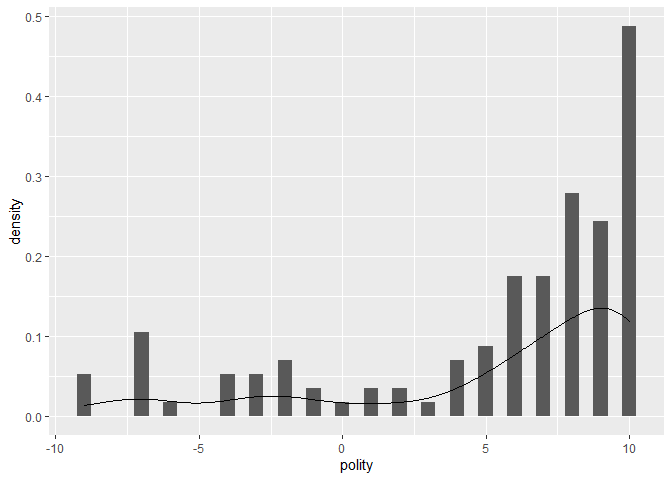
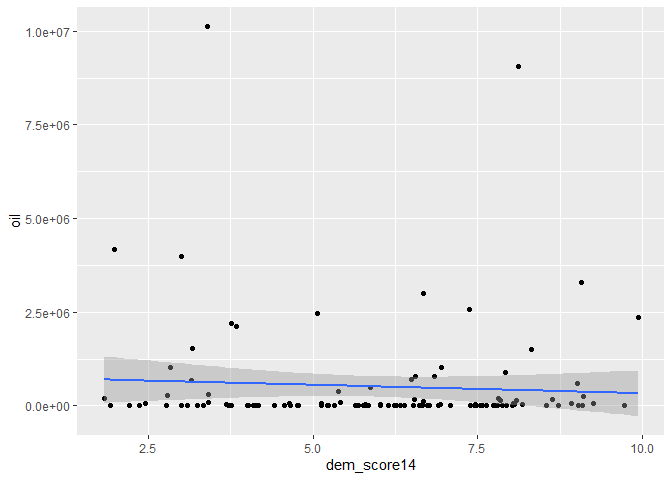

Exercicio 5
================
Teste

### Carregue o banco de dados `world` que está no pacote `poliscidata`.

``` r
library(poliscidata)

banco <- world
```

### Existem diversas medidas de democracia para os países: `dem_score14`, `democ11`, `fhrate04_rev`, `fhrate08_rev`, `polity`. Descreva-as graficamente e diga quais são as diferenças entre tais medidas.

``` r
library(tidyverse)
```

    ## -- Attaching packages --------------------------------------------- tidyverse 1.3.0 --

    ## v ggplot2 3.3.1     v purrr   0.3.4
    ## v tibble  3.0.1     v dplyr   1.0.0
    ## v tidyr   1.1.0     v stringr 1.4.0
    ## v readr   1.3.1     v forcats 0.5.0

    ## -- Conflicts ------------------------------------------------ tidyverse_conflicts() --
    ## x dplyr::filter() masks stats::filter()
    ## x dplyr::lag()    masks stats::lag()

``` r
library(scales)
```

    ## 
    ## Attaching package: 'scales'

    ## The following object is masked from 'package:purrr':
    ## 
    ##     discard

    ## The following object is masked from 'package:readr':
    ## 
    ##     col_factor

``` r
banco <-world %>%
  filter(!is.na(dem_score14),
         !is.na(democ11),
         !is.na(fhrate04_rev),
         !is.na(fhrate08_rev),
         !is.na(polity),
         !is.na(gini08))
```

\#**Descrição das variáveis**\#

``` r
banco$dem_score14
```

    ##   [1] 5.67 3.83 6.84 4.13 9.01 8.54 2.83 5.78 3.69 7.93 5.65 5.79 7.87 7.38 6.73
    ##  [16] 4.09 3.33 4.78 3.41 9.08 7.80 3.00 6.55 8.03 6.93 7.94 9.11 5.87 3.16 6.53
    ##  [31] 7.74 3.72 9.03 8.04 5.82 8.64 6.33 7.45 5.81 3.01 1.93 5.84 6.90 7.92 6.95
    ##  [46] 1.98 8.72 7.63 7.85 7.39 8.08 3.76 3.17 5.13 5.24 2.21 7.48 6.66 7.54 6.25
    ##  [61] 4.42 5.66 6.49 5.79 4.17 6.68 6.32 6.62 4.00 4.66 6.24 4.77 8.92 9.26 5.32
    ##  [76] 4.02 3.76 9.93 4.64 7.08 6.03 6.26 6.54 6.77 7.47 7.79 6.68 3.39 3.25 6.15
    ##  [91] 4.56 6.03 7.57 7.82 8.05 5.69 3.09 9.73 9.09 2.37 5.77 5.39 5.12 1.83 5.22
    ## [106] 5.42 8.31 8.11 8.17 2.45 5.07 3.41 2.79 6.39 2.78

``` r
banco$democ11
```

    ##   [1]  9  3  8  5 10 10  0  6  0  8  7  7  8  8  9  2  7  3  1 10 10  0  7 10  9
    ##  [26]  8 10  5  0  8  9  3 10  9  7 10  8 10  8  5  7  7 10  9  8  0 10 10 10  9
    ##  [51] 10  2  0  8  7  0  8  8 10  9  4  6  6  7  0  8  8 10  1  5  6  6 10 10  9
    ##  [76]  7  4 10  6  9  4  9  9  8 10 10  9  5  0  7  8  2 10  9 10  5  0 10 10  1
    ## [101]  2  7  9  0  1  6 10 10 10  0  1  0  1  7  3

``` r
banco$fhrate04_rev
```

    ##   [1] 5.0 2.5 6.0 3.5 7.0 7.0 2.5 4.0 1.5 7.0 6.0 5.0 6.0 5.5 6.5 3.5 3.0 2.5
    ##  [19] 2.0 7.0 7.0 1.5 4.0 7.0 6.0 7.0 7.0 5.0 2.5 5.5 7.0 3.0 7.0 7.0 4.5 7.0
    ##  [37] 6.0 6.5 4.0 2.5 4.0 5.0 7.0 5.5 4.5 2.0 7.0 6.0 7.0 5.5 6.5 3.5 2.5 5.0
    ##  [55] 2.5 1.5 6.5 5.5 6.0 5.0 5.0 4.0 4.0 6.0 2.5 6.0 4.5 6.0 3.5 4.5 5.5 3.0
    ##  [73] 7.0 7.0 5.0 5.0 4.0 7.0 2.5 6.5 5.0 5.0 5.5 5.5 7.0 7.0 5.5 2.5 2.5 5.5
    ##  [91] 4.5 3.5 7.0 6.5 7.0 5.0 2.0 7.0 7.0 2.5 4.5 5.5 5.0 1.0 3.5 4.5 7.0 7.0
    ## [109] 7.0 1.5 4.5 1.5 3.0 4.0 1.5
    ## attr(,"value.labels")
    ##  Most free Least free 
    ##          7          1

``` r
banco$fhrate08_rev
```

    ##   [1]  8  3 10  4 12 12  3  6  1 12 10  8 10 10 10  6  5  3  2 12 12  1  7 12 10
    ##  [26] 12 12  8  3  9 12  4 12 12  6 12 11 11  7  2  6  8 12  9  9  2 12 11 11  9
    ##  [51] 11  4  3  7  5  1 11  9 12  8  7  6  6  9  3  9  6 10  5  8 10  6 12 12  7
    ##  [76]  7  5 12  5 11  7  8  9  7 12 12 10  3  3  8  8  5 12 10 12  6  2 12 12  3
    ## [101]  7  5  8  0  5  9 12 12 12  0  6  2  4  8  1

``` r
banco$polity
```

    ##   [1]  9  2  8  5 10 10 -7  5 -7  8  7  7  8  8  9  0  6  2 -4 10 10 -7  7 10  9
    ##  [26]  8 10  5 -2  8  9  1 10  9  6 10  8 10  8  5  6  7 10  9  8 -7 10 10 10  9
    ##  [51] 10 -3 -6  8  7 -7  8  8 10  9  3  6  6  7 -2  8  8 10 -4  5  6  6 10 10  9
    ##  [76]  6  4 10  6  9  4  8  9  8 10 10  9  4 -4  7  7 -2 10  9 10  4 -9 10 10 -3
    ## [101] -1  7  9 -9 -1  6 10 10 10 -9 -3 -7 -2  7  1

\#dem\_score14 \#\# **Democracy score, higher scores more democratic
(Economist 2014)**

``` r
ggplot(banco, aes(x = dem_score14)) +
  geom_histogram(aes(y=..density..),
                 binwidth = 0.5) +
                 geom_density()
```

<!-- -->

\#democ11 \#\# **Democracy score, 2011 (UN)**

``` r
ggplot(banco, aes(x = democ11)) +
  geom_histogram(aes(y=..density..),
                 binwidth = 0.5) +
                 geom_density()
```

<!-- -->

\#fhrate04\_rev \#\# **Freedom House rating of democracy (reversed)**

``` r
ggplot(banco, aes(x = fhrate04_rev)) +
  geom_histogram(aes(y=..density..),
                 binwidth = 0.3) +
                 geom_density()
```

<!-- -->

\#fhrate08\_rev \#\# **Freedom House 1-7 scale reversed, rescaled 0-12**
\#\#\#

``` r
ggplot(banco, aes(x = fhrate08_rev)) +
  geom_histogram(aes(y=..density..),
                 binwidth = 0.5) +
                 geom_density()
```

<!-- -->

\#Polity \#\# **Higher scores more democratic (Polity)**

``` r
ggplot(banco, aes(x = polity)) +
  geom_histogram(aes(y=..density..),
                 binwidth = 0.5) +
                 geom_density()
```

<!-- -->

### Da análise geral dos gráficos das variáveis, se pode observar que todas atribuem scores aos países, a partir da análise do seu grau de democracia. A análise gráfica da variável contínua **dem\_score14**, permite observar que, com base nos critérios avaliados por ela, a maioria dos países recebeu nota superior a 5, e poucos países tiveram atribuídas escore superior a 8, assim como poucos receram nota abaixo de 3, de modo que os resultados encontra-se mais concentrados no centro do gráfico. A variável **democ11**, por sua vez, avalia a democracia com dados de 2011, e de sua análise gráfica se pode observar que, ao contrário do que ocorre com a variável **dem\_score14**, os resultados se concentram mais nas extremidades do gráfico, destacando-se que à maioria dos paídes foi atribuída nota superior a 5, numa escala de 0 a 10. A partir da análise dos gráficos da variável **fhrate04\_rev** se pode observar que a maioria dos países obteve escore superior a 4, numa escala de 1 a 7, com uma considerável elevação dos casos com escore próximo ou igual a 7. A variável **fhrate08\_rev** é uma ampliação da escala da variável anterior para 1 a 12, o que ocasiounou certa alteração na distribuição dos resultados, sobretudo entre os escores 2 a 3 da varíavel **fhrate04\_rev**. Por fim, da análise gráfica da variável **polity**, pode-se destacar o fato de que essa medida atribuiu escores entre -10 e 10 aos países, possuindo valores negativos, diferentemente de todas as demais. É observar, ainda, que a maior concetração de casos está entre zero e 10, com um número considerável de países tendo recebido escore máximo.

### Avalie a relação entre todas as medidas de democracia e desigualdade, utilizando a variável `gini08`. Descreva graficamente esta variável, a relação entre as duas variáveis, meça a correlação entre elas e faça regressões lineares (interpretando em profundidade os resultados dos coeficientes e medidas de desempenho dos modelos). Enfatize as semelhanças e diferenças entre os resultados. Quais são suas conclusões?

``` r
banco$gini08
```

    ##   [1] 31.1 35.3 51.3 33.8 35.2 29.1 36.5 33.4 29.7 33.0 36.5 60.1 60.5 57.0 29.2
    ##  [16] 39.5 42.4 41.7 44.6 32.6 54.9 46.9 58.6 49.8 29.0 25.4 24.7 53.6 34.4 52.4
    ##  [31] 35.8 30.0 26.9 32.7 40.4 28.3 40.8 34.3 55.1 38.6 47.0 53.8 26.9 36.8 34.3
    ##  [46] 43.0 34.3 39.2 36.0 45.5 24.9 38.8 33.9 42.5 30.3 34.6 37.7 63.2 36.0 39.0
    ##  [61] 47.5 39.0 49.2 40.1 39.0 46.1 33.2 32.8 39.5 47.3 74.3 47.2 30.9 36.2 43.1
    ##  [76] 50.5 43.7 25.8 30.6 56.1 50.9 58.4 52.0 44.5 34.5 38.5 31.0 39.9 46.8 41.3
    ##  [91] 62.9 42.5 28.4 57.8 34.7 40.2 50.4 25.0 33.7 32.6 34.6 42.0 43.6 40.8 45.7
    ## [106] 28.1 36.0 40.8 44.9 36.8 48.2 34.4 33.4 50.8 50.1

``` r
ggplot(banco, aes(x = gini08)) +
  geom_histogram(aes(y=..density..),
                 binwidth = 2) +
                 geom_density()
```

<!-- -->

``` r
#gini08 x dem_score14

ggplot(banco, aes(gini08, dem_score14)) +
geom_jitter()
```

<!-- -->

``` r
cor.test(banco$gini08, banco$dem_score14)
```

    ## 
    ##  Pearson's product-moment correlation
    ## 
    ## data:  banco$gini08 and banco$dem_score14
    ## t = -1.7824, df = 113, p-value = 0.07737
    ## alternative hypothesis: true correlation is not equal to 0
    ## 95 percent confidence interval:
    ##  -0.3382358  0.0182973
    ## sample estimates:
    ##        cor 
    ## -0.1653672

``` r
ggplot(banco, aes(dem_score14, gini08)) +
  geom_point() +
  geom_smooth(method = "lm")
```

    ## `geom_smooth()` using formula 'y ~ x'

<!-- -->

``` r
regressao1 <- lm(dem_score14 ~ gini08, data = banco)  


summary(regressao1)
```

    ## 
    ## Call:
    ## lm(formula = dem_score14 ~ gini08, data = banco)
    ## 
    ## Residuals:
    ##     Min      1Q  Median      3Q     Max 
    ## -4.1187 -1.6272  0.3562  1.6112  3.4717 
    ## 
    ## Coefficients:
    ##             Estimate Std. Error t value Pr(>|t|)    
    ## (Intercept)  7.33487    0.79633   9.211 2.05e-15 ***
    ## gini08      -0.03397    0.01906  -1.782   0.0774 .  
    ## ---
    ## Signif. codes:  0 '***' 0.001 '**' 0.01 '*' 0.05 '.' 0.1 ' ' 1
    ## 
    ## Residual standard error: 1.998 on 113 degrees of freedom
    ## Multiple R-squared:  0.02735,    Adjusted R-squared:  0.01874 
    ## F-statistic: 3.177 on 1 and 113 DF,  p-value: 0.07737

\#\#Interpretando os resultados da regressão, podemos observar os
resíduos, com mínimo de -4.1187 e máximo de 3.4717. O RMSE (erro
padrão), que representa a distância média dos valores que foram
observados para os estimados, é 1.998. O intercepto, (valor de y para
para a variável independente igual a zero) é 7,33487, com erro padrão de
0,79633 e t de 9,211, além de p-valor de 2.05e-15. O β, que representa a
mudança da variável dependente para cada mudança em unidades de X, é
-0,03397 (indicando uma relação negativa, curva decrescente no gráfico),
com erro padrão de 0,01906, t de -1,782 e p-valor de 0,0774, valor alto,
que indica baixa significância. O xˆ2 é 0.02735, indicando que X só
explica Y em 2,73% das vezes.

\#gini x democ11

``` r
ggplot(banco, aes(gini08, democ11)) +
geom_jitter()
```

<!-- -->

``` r
cor.test(banco$gini08, banco$democ11)
```

    ## 
    ##  Pearson's product-moment correlation
    ## 
    ## data:  banco$gini08 and banco$democ11
    ## t = -0.90439, df = 113, p-value = 0.3677
    ## alternative hypothesis: true correlation is not equal to 0
    ## 95 percent confidence interval:
    ##  -0.26378781  0.09988899
    ## sample estimates:
    ##         cor 
    ## -0.08477203

``` r
ggplot(banco, aes(democ11, gini08)) +
  geom_point() +
  geom_smooth(method = "lm")
```

    ## `geom_smooth()` using formula 'y ~ x'

<!-- -->

``` r
regressao2 <- lm(democ11 ~ gini08, data = banco)


summary(regressao2)
```

    ## 
    ## Call:
    ## lm(formula = democ11 ~ gini08, data = banco)
    ## 
    ## Residuals:
    ##    Min     1Q Median     3Q    Max 
    ## -6.796 -2.213  1.302  3.049  3.958 
    ## 
    ## Coefficients:
    ##             Estimate Std. Error t value Pr(>|t|)    
    ## (Intercept)  7.68568    1.38306   5.557 1.85e-07 ***
    ## gini08      -0.02994    0.03311  -0.904    0.368    
    ## ---
    ## Signif. codes:  0 '***' 0.001 '**' 0.01 '*' 0.05 '.' 0.1 ' ' 1
    ## 
    ## Residual standard error: 3.47 on 113 degrees of freedom
    ## Multiple R-squared:  0.007186,   Adjusted R-squared:  -0.0016 
    ## F-statistic: 0.8179 on 1 and 113 DF,  p-value: 0.3677

\#\#Interpretando os resultados da regressão, podemos observar os
resíduos, com mínimo de -6.796 e máximo de 3.958. O RMSE (erro padrão),
que representa a distância média dos valores que foram observados para
os estimados, é 3.47 . O intercepto, (valor de y para para a variável
independente igual a zero) é 7.68568, com erro padrão de 1.38306 e t de
5.557, e p-valor de 1.85e-07. O β, que representa a mudança da variável
dependente para cada mudança em unidades de X, é -0.02994 (indicando uma
relação negativa, curva decrescente no gráfico), com erro padrão de
0.03311, t de -0.904 e p-valor de 0.368, valor alto, que indica baixa
significância. O xˆ2 é 0.007186, indicando que X só explica Y em 0,71%
das vezes.

\#gini08 x fhrate04\_rev

``` r
ggplot(banco, aes(gini08, fhrate04_rev)) +
geom_jitter()
```

<!-- -->

``` r
cor.test(banco$gini08, banco$fhrate04_rev)
```

    ## 
    ##  Pearson's product-moment correlation
    ## 
    ## data:  banco$gini08 and banco$fhrate04_rev
    ## t = -1.2625, df = 113, p-value = 0.2094
    ## alternative hypothesis: true correlation is not equal to 0
    ## 95 percent confidence interval:
    ##  -0.29468718  0.06660813
    ## sample estimates:
    ##        cor 
    ## -0.1179408

``` r
ggplot(banco, aes(fhrate04_rev, gini08)) +
  geom_point() +
  geom_smooth(method = "lm")
```

    ## `geom_smooth()` using formula 'y ~ x'

<!-- -->

``` r
regressao3 <- lm(fhrate04_rev ~ gini08, data = banco)


summary(regressao3)
```

    ## 
    ## Call:
    ## lm(formula = fhrate04_rev ~ gini08, data = banco)
    ## 
    ## Residuals:
    ##     Min      1Q  Median      3Q     Max 
    ## -3.8700 -1.3979  0.4045  1.6741  2.4324 
    ## 
    ## Coefficients:
    ##             Estimate Std. Error t value Pr(>|t|)    
    ## (Intercept)  5.74513    0.70975   8.095 7.32e-13 ***
    ## gini08      -0.02145    0.01699  -1.263    0.209    
    ## ---
    ## Signif. codes:  0 '***' 0.001 '**' 0.01 '*' 0.05 '.' 0.1 ' ' 1
    ## 
    ## Residual standard error: 1.781 on 113 degrees of freedom
    ## Multiple R-squared:  0.01391,    Adjusted R-squared:  0.005184 
    ## F-statistic: 1.594 on 1 and 113 DF,  p-value: 0.2094

\#\#Interpretando os resultados da regressão, podemos observar os
resíduos, com mínimo de -3.8700 e máximo de 2.4324. O RMSE (erro
padrão), que representa a distância média dos valores que foram
observados para os estimados, é 1.781 . O intercepto, (valor de y para
para a variável independente igual a zero) é 5.74513. O β, que
representa a mudança da variável dependente para cada mudança em
unidades de X, é -0.02145 (indicando uma relação negativa, curva
decrescente no gráfico), com erro padrão de 0.01699, t de -1.263 e
p-valor de p-value: 0.2094, valor alto, que indica baixa significância.
O xˆ2 é 0.01391, indicando que X só explica Y em 1,39% das vezes.

\#gini08 x fhrate08\_rev

``` r
ggplot(banco, aes(gini08, fhrate08_rev)) +
geom_jitter()
```

<!-- -->

``` r
cor.test(banco$gini08, banco$fhrate08_rev)
```

    ## 
    ##  Pearson's product-moment correlation
    ## 
    ## data:  banco$gini08 and banco$fhrate08_rev
    ## t = -1.2591, df = 113, p-value = 0.2106
    ## alternative hypothesis: true correlation is not equal to 0
    ## 95 percent confidence interval:
    ##  -0.29439757  0.06692384
    ## sample estimates:
    ##        cor 
    ## -0.1176281

``` r
ggplot(banco, aes(fhrate08_rev, gini08)) +
  geom_point() +
  geom_smooth(method = "lm")         
```

    ## `geom_smooth()` using formula 'y ~ x'

<!-- -->

``` r
regressao4 <- lm(fhrate08_rev ~ gini08, data = banco)


summary(regressao4)
```

    ## 
    ## Call:
    ## lm(formula = fhrate08_rev ~ gini08, data = banco)
    ## 
    ## Residuals:
    ##     Min      1Q  Median      3Q     Max 
    ## -7.9023 -2.6609  0.7259  3.4246  4.8712 
    ## 
    ## Coefficients:
    ##             Estimate Std. Error t value Pr(>|t|)    
    ## (Intercept)  9.47485    1.41785   6.683 9.28e-10 ***
    ## gini08      -0.04273    0.03394  -1.259    0.211    
    ## ---
    ## Signif. codes:  0 '***' 0.001 '**' 0.01 '*' 0.05 '.' 0.1 ' ' 1
    ## 
    ## Residual standard error: 3.558 on 113 degrees of freedom
    ## Multiple R-squared:  0.01384,    Adjusted R-squared:  0.005109 
    ## F-statistic: 1.585 on 1 and 113 DF,  p-value: 0.2106

\#\#Interpretando os resultados da regressão, podemos observar os
resíduos, com mínimo de -7.9023 e máximo de 4.8712. O RMSE (erro
padrão), que representa a distância média dos valores que foram
observados para os estimados, é 3.558 . O intercepto, (valor de y para
para a variável independente igual a zero) é 9.47485. O β, que
representa a mudança da variável dependente para cada mudança em
unidades de X, é -0.04273 (indicando uma relação negativa, curva
decrescente no gráfico), com erro padrão de 0.03394, t de -1.259 e
p-valor de 0.211, valor alto, que indica baixa significância. O xˆ2 é
0.01384, indicando que X só explica Y em 1,38% das vezes.

\#gini08 x polity

``` r
ggplot(banco, aes(gini08, polity)) +
geom_jitter()
```

<!-- -->

``` r
ggplot(banco, aes(polity, gini08)) +
  geom_point() +
  geom_smooth(method = "lm")
```

    ## `geom_smooth()` using formula 'y ~ x'

<!-- -->

``` r
regressao5 <- lm(polity ~ gini08, data = banco)


summary(regressao5)
```

    ## 
    ## Call:
    ## lm(formula = polity ~ gini08, data = banco)
    ## 
    ## Residuals:
    ##     Min      1Q  Median      3Q     Max 
    ## -14.374  -1.300   2.364   4.087   5.040 
    ## 
    ## Coefficients:
    ##             Estimate Std. Error t value Pr(>|t|)   
    ## (Intercept)  6.21813    2.20594   2.819  0.00569 **
    ## gini08      -0.02292    0.05280  -0.434  0.66499   
    ## ---
    ## Signif. codes:  0 '***' 0.001 '**' 0.01 '*' 0.05 '.' 0.1 ' ' 1
    ## 
    ## Residual standard error: 5.535 on 113 degrees of freedom
    ## Multiple R-squared:  0.001665,   Adjusted R-squared:  -0.007169 
    ## F-statistic: 0.1885 on 1 and 113 DF,  p-value: 0.665

\#\#Interpretando os resultados da regressão, podemos observar os
resíduos, com mínimo de -7.9023 e máximo de 5.040. O RMSE (erro
padrão), que representa a distância média dos valores que foram
observados para os estimados, é 5.535. O intercepto, (valor de y para
para a variável independente igual a zero) é 6.21813 . O β, que
representa a mudança da variável dependente para cada mudança em
unidades de X, é -0.02292 (indicando uma relação negativa, curva
decrescente no gráfico), com erro padrão de 0.05280 , t de -0.434 e
p-valor de 0.66499, valor alto, que indica baixa significância. O xˆ2 é
0.001665, indicando que X só explica Y em 0,16% das vezes.

## A análise dos resultados obtidos por meio dos testes de correlação e dos modelos de regressão permite obervar que as variáveis de democracia, quando associadas à variável ‘gini08’, que mede desigualdade, de modo geral, apresentaram alto p-valor, o que demonstra baixa significância. Além disso, os resultados obtidos para o rˆ2 variaram entre 0,16 e 2,73%, isto é, baixo valor explicativo entre as variáveis correlacionadas.

### Avalie a relação entre todas as medidas de democracia e crescimento econômico, utilizando a variável `gdppcap08`. Descreva graficamente esta variável, a relação entre as duas variáveis, meça a correlação entre elas e faça regressões lineares (interpretando em profundidade os resultados dos coeficientes e medidas de desempenho dos modelos). Enfatize as semelhanças e diferenças entre os resultados. Quais são suas conclusões?

``` r
ggplot(banco, aes(x = gdppcap08)) +
  geom_histogram(aes(y=..density..),
                 binwidth = 0.5) +
                 geom_density()
```

<!-- -->

\#gdppcap08 x dem\_score14

\`\`{r} ggplot(banco, aes(gdppcap08, dem\_score14)) + geom\_jitter()

cor.test(banco\(gdppcap08, banco\)dem\_score14)

ggplot(banco, aes(dem\_score14, gdppcap08)) + geom\_point() +
geom\_smooth(method = “lm”)

regressao2.1 \<- lm(dem\_score14 \~ gdppcap08, data = banco)

summary(regressao2.1)

```` 

##Interpretando os resultados da regressão, podemos observar os resíduos, com mínimo de -3.8534 e máximo de 2.9946. O RMSE (erro padrão), que representa a distância média dos valores que foram observados para os estimados, é 1.433. O intercepto, (valor de y para para a variável independente igual a zero) é 4.615e+00. O β, que representa a mudança da variável dependente para cada mudança em unidades de X, é 1.044e-04  (indicando uma relação positiva, curva ascendente no gráfico), com erro padrão de 9.833e-06 , t de 10.62 e p-valor de 2e-16, baixo valor, que indica alta significância. O xˆ2 é 0.4996, indicando que X só explica Y em 49,96% das vezes.


#gdppcap x democ11


```r
ggplot(banco, aes(gdppcap08, democ11)) +
geom_jitter()
````

<!-- -->

``` r
cor.test(banco$gdppcap08, banco$democ11)
```

    ## 
    ##  Pearson's product-moment correlation
    ## 
    ## data:  banco$gdppcap08 and banco$democ11
    ## t = 6.1836, df = 113, p-value = 1.025e-08
    ## alternative hypothesis: true correlation is not equal to 0
    ## 95 percent confidence interval:
    ##  0.3521309 0.6281004
    ## sample estimates:
    ##       cor 
    ## 0.5028201

``` r
ggplot(banco, aes(democ11, gdppcap08)) +
  geom_point() +
  geom_smooth(method = "lm")
```

    ## `geom_smooth()` using formula 'y ~ x'

<!-- -->

``` r
regressao2.2 <- lm(democ11 ~ gdppcap08, data = banco)


summary(regressao2.2)
```

    ## 
    ## Call:
    ## lm(formula = democ11 ~ gdppcap08, data = banco)
    ## 
    ## Residuals:
    ##    Min     1Q Median     3Q    Max 
    ## -9.126 -1.546  0.985  2.171  4.713 
    ## 
    ## Coefficients:
    ##              Estimate Std. Error t value Pr(>|t|)    
    ## (Intercept) 4.831e+00  3.860e-01  12.515  < 2e-16 ***
    ## gdppcap08   1.277e-04  2.065e-05   6.184 1.03e-08 ***
    ## ---
    ## Signif. codes:  0 '***' 0.001 '**' 0.01 '*' 0.05 '.' 0.1 ' ' 1
    ## 
    ## Residual standard error: 3.01 on 113 degrees of freedom
    ## Multiple R-squared:  0.2528, Adjusted R-squared:  0.2462 
    ## F-statistic: 38.24 on 1 and 113 DF,  p-value: 1.025e-08

\#\#Interpretando os resultados da regressão, podemos observar os
resíduos, com mínimo de -9.126 e máximo de 4.713. O RMSE (erro padrão),
que representa a distância média dos valores que foram observados para
os estimados, é 3.01. O intercepto, (valor de y para para a variável
independente igual a zero) é 4.831e+00. O β, que representa a mudança da
variável dependente para cada mudança em unidades de X, é 1.277e-04
(indicando uma relação positiva, curva ascendente no gráfico), com erro
padrão de 2.065e-05 , t de 6.184 e p-valor de 1.03e-08, baixo valor, que
indica alta significância. O xˆ2 é 0.2528, indicando que X só explica Y
em 25,28% das vezes.

\#gdppcap08 x fhrate04\_rev

``` r
ggplot(banco, aes(gdppcap08, fhrate04_rev)) +
geom_jitter()
```

<!-- -->

``` r
cor.test(banco$gdppcap08, banco$fhrate04_rev)
```

    ## 
    ##  Pearson's product-moment correlation
    ## 
    ## data:  banco$gdppcap08 and banco$fhrate04_rev
    ## t = 8.4081, df = 113, p-value = 1.423e-13
    ## alternative hypothesis: true correlation is not equal to 0
    ## 95 percent confidence interval:
    ##  0.4932910 0.7215154
    ## sample estimates:
    ##       cor 
    ## 0.6203658

``` r
ggplot(banco, aes(fhrate04_rev, gdppcap08)) +
  geom_point() +
  geom_smooth(method = "lm")
```

    ## `geom_smooth()` using formula 'y ~ x'

<!-- -->

``` r
regressao2.3 <- lm(fhrate04_rev ~ gdppcap08, data = banco)


summary(regressao2.3)
```

    ## 
    ## Call:
    ## lm(formula = fhrate04_rev ~ gdppcap08, data = banco)
    ## 
    ## Residuals:
    ##     Min      1Q  Median      3Q     Max 
    ## -4.3318 -0.8448  0.2847  0.9975  2.2549 
    ## 
    ## Coefficients:
    ##              Estimate Std. Error t value Pr(>|t|)    
    ## (Intercept) 3.833e+00  1.804e-01  21.252  < 2e-16 ***
    ## gdppcap08   8.114e-05  9.650e-06   8.408 1.42e-13 ***
    ## ---
    ## Signif. codes:  0 '***' 0.001 '**' 0.01 '*' 0.05 '.' 0.1 ' ' 1
    ## 
    ## Residual standard error: 1.407 on 113 degrees of freedom
    ## Multiple R-squared:  0.3849, Adjusted R-squared:  0.3794 
    ## F-statistic:  70.7 on 1 and 113 DF,  p-value: 1.423e-13

\#\#Interpretando os resultados da regressão, podemos observar os
resíduos, com mínimo de -4.3318 e máximo de 2.2549. O RMSE (erro
padrão), que representa a distância média dos valores que foram
observados para os estimados, é 1.407. O intercepto, (valor de y para
para a variável independente igual a zero) é 3.833e+00. O β, que
representa a mudança da variável dependente para cada mudança em
unidades de X, é 9.650e-06 (indicando uma relação positiva, curva
ascendente no gráfico), com erro padrão de 3.458e-05 , t de 4.846 e
p-valor de 1.42e-13, baixo valor, que indica alta significância. O xˆ2 é
0.3849, indicando que X só explica Y em 38,49% das vezes.

\#gdppcap08 x fhrate08\_rev

``` r
ggplot(banco, aes(gdppcap08, fhrate08_rev)) +
geom_jitter()
```

<!-- -->

``` r
cor.test(banco$gdppcap08, banco$fhrate08_rev)
```

    ## 
    ##  Pearson's product-moment correlation
    ## 
    ## data:  banco$gdppcap08 and banco$fhrate08_rev
    ## t = 8.4371, df = 113, p-value = 1.222e-13
    ## alternative hypothesis: true correlation is not equal to 0
    ## 95 percent confidence interval:
    ##  0.4949088 0.7225399
    ## sample estimates:
    ##       cor 
    ## 0.6216807

``` r
ggplot(banco, aes(fhrate08_rev, gdppcap08)) +
  geom_point() +
  geom_smooth(method = "lm")         
```

    ## `geom_smooth()` using formula 'y ~ x'

<!-- -->

``` r
regressao2.4 <- lm(fhrate08_rev ~ gdppcap08, data = banco)


summary(regressao2.4)
```

    ## 
    ## Call:
    ## lm(formula = fhrate08_rev ~ gdppcap08, data = banco)
    ## 
    ## Residuals:
    ##     Min      1Q  Median      3Q     Max 
    ## -8.6604 -1.5516  0.5715  2.0766  5.1088 
    ## 
    ## Coefficients:
    ##              Estimate Std. Error t value Pr(>|t|)    
    ## (Intercept) 5.655e+00  3.598e-01  15.718  < 2e-16 ***
    ## gdppcap08   1.624e-04  1.925e-05   8.437 1.22e-13 ***
    ## ---
    ## Signif. codes:  0 '***' 0.001 '**' 0.01 '*' 0.05 '.' 0.1 ' ' 1
    ## 
    ## Residual standard error: 2.806 on 113 degrees of freedom
    ## Multiple R-squared:  0.3865, Adjusted R-squared:  0.3811 
    ## F-statistic: 71.19 on 1 and 113 DF,  p-value: 1.222e-13

\#\#Interpretando os resultados da regressão, podemos observar os
resíduos, com mínimo de -8.6604 e máximo de 5.1088. O RMSE (erro
padrão), que representa a distância média dos valores que foram
observados para os estimados, é 2.806 . O intercepto, (valor de y para
para a variável independente igual a zero) é 5.655e+00. O β, que
representa a mudança da variável dependente para cada mudança em
unidades de X, é 1.624e-04 (indicando uma relação positiva, curva
ascendente no gráfico), com erro padrão de 1.925e-05 , t de 8.437 e
p-valor de 1.22e-13, baixo valor, que indica alta significância. O xˆ2 é
0.3865, indicando que X só explica Y em 38,65% das vezes.

\#gdppcap08 x polity

``` r
ggplot(banco, aes(gdppcap08, polity)) +
geom_jitter()
```

<!-- -->

``` r
ggplot(banco, aes(polity, gdppcap08)) +
  geom_point() +
  geom_smooth(method = "lm")
```

    ## `geom_smooth()` using formula 'y ~ x'

<!-- -->

``` r
regressao2.5 <- lm(polity ~ gdppcap08, data = banco)


summary(regressao2.5)
```

    ## 
    ## Call:
    ## lm(formula = polity ~ gdppcap08, data = banco)
    ## 
    ## Residuals:
    ##     Min      1Q  Median      3Q     Max 
    ## -13.396  -1.211   1.720   3.591   6.265 
    ## 
    ## Coefficients:
    ##              Estimate Std. Error t value Pr(>|t|)    
    ## (Intercept) 3.137e+00  6.463e-01   4.854 3.92e-06 ***
    ## gdppcap08   1.676e-04  3.458e-05   4.846 4.05e-06 ***
    ## ---
    ## Signif. codes:  0 '***' 0.001 '**' 0.01 '*' 0.05 '.' 0.1 ' ' 1
    ## 
    ## Residual standard error: 5.041 on 113 degrees of freedom
    ## Multiple R-squared:  0.172,  Adjusted R-squared:  0.1647 
    ## F-statistic: 23.48 on 1 and 113 DF,  p-value: 4.052e-06

\#\#Interpretando os resultados da regressão, podemos observar os
resíduos, com mínimo de -13.396 e máximo de 6.265. O RMSE (erro
padrão), que representa a distância média dos valores que foram
observados para os estimados, é 5.041. O intercepto, (valor de y para
para a variável independente igual a zero) é 3.137e+00. O β, que
representa a mudança da variável dependente para cada mudança em
unidades de X, é 1.676e-04 (indicando uma relação positiva, curva
ascendente no gráfico), com erro padrão de 3.458e-05, t de 4.846 e
p-valor de 4.05e-06, baixo valor, que indica alta significância. O xˆ2 é
0.172, indicando que X só explica Y em 17,2% das vezes.

## A análise dos resultados obtidos por meio dos testes de correlação e dos modelos de regressão permite obervar que as variáveis de democracia, quando associadas à variável ‘gdppcap08’, que mede o PIB per capita, de modo geral, apresentaram baixo p-valor, o que demonstra alta significância. Já os resultados obtidos para o rˆ2 apresentaram grande variação, entre 17,2% e 49,86%. Embora o valor explicativo não chegue a ser muito alto em relação a nenhuma das variáveis de democracia, chama atenção o fato de que mesmo que todas as variáveis afiram democracia, o resultado do rˆ2 variou muito entre elas. Nota-se que há significância estatítica nessas correlações, no entanto, é possível que haja outras variáveis que precisam ser consideradas para aferir essa relação.

### Avalie a relação entre todas as medidas de democracia e produção de petróleo, utilizando a variável `oil`. Descreva graficamente esta variável, a relação entre as duas variáveis, meça a correlação entre elas e faça regressões lineares (interpretando em profundidade os resultados dos coeficientes e medidas de desempenho dos modelos). Enfatize as semelhanças e diferenças entre os resultados. Quais são suas conclusões?

``` r
banco$oil
```

    ##   [1] 5.400e+03 2.125e+06 7.963e+05 0.000e+00 5.892e+05 2.188e+04 1.011e+06
    ##   [8] 5.733e+03 3.140e+04 1.122e+04 0.000e+00 4.374e+04 0.000e+00 2.572e+06
    ##  [15] 3.227e+03 0.000e+00 0.000e+00 0.000e+00 7.731e+04 3.289e+06 1.085e+04
    ##  [22] 3.991e+06 7.850e+05 0.000e+00 2.396e+04 1.097e+04 2.621e+05 4.857e+05
    ##  [29] 6.805e+05 0.000e+00 7.600e+03 0.000e+00 8.718e+03 7.082e+04 9.949e+02
    ##  [36] 1.568e+05 7.081e+03 6.779e+03 1.353e+04 0.000e+00 0.000e+00 0.000e+00
    ##  [43] 2.143e+04 8.787e+05 1.023e+06 4.172e+06 0.000e+00 3.806e+03 1.465e+05
    ##  [50] 0.000e+00 1.327e+05 0.000e+00 1.540e+06 0.000e+00 9.791e+02 0.000e+00
    ##  [57] 0.000e+00 0.000e+00 6.333e+03 0.000e+00 0.000e+00 0.000e+00 6.937e+05
    ##  [64] 0.000e+00 1.651e+04 3.001e+06 0.000e+00 5.975e+03 4.053e+03 0.000e+00
    ##  [71] 0.000e+00 0.000e+00 5.719e+04 6.115e+04 0.000e+00 0.000e+00 2.211e+06
    ##  [78] 2.350e+06 5.914e+04 0.000e+00 3.509e+04 3.096e+01 1.572e+05 9.671e+03
    ##  [85] 3.414e+04 4.721e+03 1.170e+05 1.012e+07 0.000e+00 0.000e+00 2.898e+01
    ##  [92] 1.091e+04 5.000e+00 1.910e+05 2.723e+04 0.000e+00 0.000e+00 4.833e+03
    ##  [99] 3.488e+03 2.210e+02 0.000e+00 3.800e+05 5.298e+04 1.977e+05 0.000e+00
    ## [106] 9.993e+04 1.502e+06 9.056e+06 4.011e+04 7.091e+04 2.472e+06 3.006e+05
    ## [113] 2.884e+05 1.595e+02 0.000e+00

``` r
ggplot(banco, aes(x = oil)) +
  geom_histogram(aes(y=..density..),
                 binwidth = 0.5) +
                 geom_density()
```

    ## Warning: Computation failed in `stat_bin()`:
    ## The number of histogram bins must be less than 1,000,000.
    ## Did you make `binwidth` too small?

<!-- -->

\#oil x dem\_score14

``` r
ggplot(banco, aes(oil, dem_score14)) +
geom_jitter()
```

<!-- -->

``` r
cor.test(banco$oil, banco$dem_score14)
```

    ## 
    ##  Pearson's product-moment correlation
    ## 
    ## data:  banco$oil and banco$dem_score14
    ## t = -0.65492, df = 113, p-value = 0.5138
    ## alternative hypothesis: true correlation is not equal to 0
    ## 95 percent confidence interval:
    ##  -0.2418802  0.1230022
    ## sample estimates:
    ##         cor 
    ## -0.06149326

``` r
ggplot(banco, aes(dem_score14, oil)) +
  geom_point() +
  geom_smooth(method = "lm")
```

    ## `geom_smooth()` using formula 'y ~ x'

<!-- -->

``` r
regressao3.1 <- lm(dem_score14 ~ oil, data = banco)  


summary(regressao3.1)
```

    ## 
    ## Call:
    ## lm(formula = dem_score14 ~ oil, data = banco)
    ## 
    ## Residuals:
    ##     Min      1Q  Median      3Q     Max 
    ## -4.1512 -1.6658  0.1521  1.6158  4.1304 
    ## 
    ## Coefficients:
    ##               Estimate Std. Error t value Pr(>|t|)    
    ## (Intercept)  5.998e+00  1.997e-01  30.035   <2e-16 ***
    ## oil         -8.441e-08  1.289e-07  -0.655    0.514    
    ## ---
    ## Signif. codes:  0 '***' 0.001 '**' 0.01 '*' 0.05 '.' 0.1 ' ' 1
    ## 
    ## Residual standard error: 2.022 on 113 degrees of freedom
    ## Multiple R-squared:  0.003781,   Adjusted R-squared:  -0.005035 
    ## F-statistic: 0.4289 on 1 and 113 DF,  p-value: 0.5138

\#\#Interpretando os resultados da regressão, podemos observar os
resíduos, com mínimo de -4.1512 e máximo de 4.1304. O RMSE (erro
padrão), que representa a distância média dos valores que foram
observados para os estimados, é 2.022. O intercepto, (valor de y para
para a variável independente igual a zero) é 5.998e+00. O β, que
representa a mudança da variável dependente para cada mudança em
unidades de X, é -8.441e-08 (indicando uma relação negativa, curva
descendente no gráfico), com erro padrão de 1.289e-075, t de -0.655 e
p-valor de 0.514, alto valor, que indica baixa significância. O xˆ2 é
0.003781, indicando que X só explica Y em 0,37% das vezes.

\#oil x democ11

``` r
ggplot(banco, aes(oil, democ11)) +
geom_jitter()
```

<!-- -->

``` r
cor.test(banco$oil, banco$democ11)
```

    ## 
    ##  Pearson's product-moment correlation
    ## 
    ## data:  banco$oil and banco$democ11
    ## t = -0.79846, df = 113, p-value = 0.4263
    ## alternative hypothesis: true correlation is not equal to 0
    ## 95 percent confidence interval:
    ##  -0.2545211  0.1097138
    ## sample estimates:
    ##         cor 
    ## -0.07490142

``` r
ggplot(banco, aes(democ11, oil)) +
  geom_point() +
  geom_smooth(method = "lm")
```

    ## `geom_smooth()` using formula 'y ~ x'

<!-- -->

``` r
regressao3.2 <- lm(democ11 ~ oil, data = banco)


summary(regressao3.2)
```

    ## 
    ## Call:
    ## lm(formula = democ11 ~ oil, data = banco)
    ## 
    ## Residuals:
    ##    Min     1Q Median     3Q    Max 
    ## -6.560 -2.361  1.440  2.535  5.041 
    ## 
    ## Coefficients:
    ##               Estimate Std. Error t value Pr(>|t|)    
    ## (Intercept)  6.560e+00  3.430e-01  19.126   <2e-16 ***
    ## oil         -1.767e-07  2.214e-07  -0.798    0.426    
    ## ---
    ## Signif. codes:  0 '***' 0.001 '**' 0.01 '*' 0.05 '.' 0.1 ' ' 1
    ## 
    ## Residual standard error: 3.473 on 113 degrees of freedom
    ## Multiple R-squared:  0.00561,    Adjusted R-squared:  -0.00319 
    ## F-statistic: 0.6375 on 1 and 113 DF,  p-value: 0.4263

\#\#Interpretando os resultados da regressão, podemos observar os
resíduos, com mínimo de -6.560 e máximo de 5.041. O RMSE (erro padrão),
que representa a distância média dos valores que foram observados para
os estimados, é 3.473. O intercepto, (valor de y para para a variável
independente igual a zero) é 6.560e+00. O β, que representa a mudança da
variável dependente para cada mudança em unidades de X, é -1.767e-07
(indicando uma relação negativa, curva discretamente descendente no
gráfico), com erro padrão de 2.214e-07, t de -0.798 e p-valor de 0.426,
alto valor, que indica baixa significância. O xˆ2 é 0.00561, indicando
que X só explica Y em 0,56% das vezes.

\#oil x fhrate04\_rev

``` r
ggplot(banco, aes(oil, fhrate04_rev)) +
geom_jitter()
```

<!-- -->

``` r
cor.test(banco$oil, banco$fhrate04_rev)
```

    ## 
    ##  Pearson's product-moment correlation
    ## 
    ## data:  banco$oil and banco$fhrate04_rev
    ## t = -0.87768, df = 113, p-value = 0.382
    ## alternative hypothesis: true correlation is not equal to 0
    ## 95 percent confidence interval:
    ##  -0.2614566  0.1023673
    ## sample estimates:
    ##         cor 
    ## -0.08228558

``` r
ggplot(banco, aes(fhrate04_rev, oil)) +
  geom_point() +
  geom_smooth(method = "lm")
```

    ## `geom_smooth()` using formula 'y ~ x'

<!-- -->

``` r
regressao3.3 <- lm(fhrate04_rev ~ oil, data = banco)


summary(regressao3.3)
```

    ## 
    ## Call:
    ## lm(formula = fhrate04_rev ~ oil, data = banco)
    ## 
    ## Residuals:
    ##     Min      1Q  Median      3Q     Max 
    ## -3.9052 -1.4247  0.0786  1.5821  2.9805 
    ## 
    ## Coefficients:
    ##               Estimate Std. Error t value Pr(>|t|)    
    ## (Intercept)  4.925e+00  1.765e-01  27.902   <2e-16 ***
    ## oil         -9.998e-08  1.139e-07  -0.878    0.382    
    ## ---
    ## Signif. codes:  0 '***' 0.001 '**' 0.01 '*' 0.05 '.' 0.1 ' ' 1
    ## 
    ## Residual standard error: 1.787 on 113 degrees of freedom
    ## Multiple R-squared:  0.006771,   Adjusted R-squared:  -0.002019 
    ## F-statistic: 0.7703 on 1 and 113 DF,  p-value: 0.382

\#\#Interpretando os resultados da regressão, podemos observar os
resíduos, com mínimo de -3.9052 e máximo de 2.9805. O RMSE (erro
padrão), que representa a distância média dos valores que foram
observados para os estimados, é 1.787. O intercepto, (valor de y para
para a variável independente igual a zero) é 4.925e+00. O β, que
representa a mudança da variável dependente para cada mudança em
unidades de X, é -9.998e-08 (indicando uma relação negativa, curva
discretamente descendente no gráfico), com erro padrão de 1.139e-07, t
de -0.878 e p-valor de 0.382, alto valor, que indica baixa
significância. O xˆ2 é 0.006771, indicando que X só explica Y em 0,67%
das vezes.

\#oil x fhrate08\_rev

``` r
ggplot(banco, aes(oil, fhrate08_rev)) +
geom_jitter()
```

<!-- -->

``` r
cor.test(banco$oil, banco$fhrate08_rev)
```

    ## 
    ##  Pearson's product-moment correlation
    ## 
    ## data:  banco$oil and banco$fhrate08_rev
    ## t = -0.9324, df = 113, p-value = 0.3531
    ## alternative hypothesis: true correlation is not equal to 0
    ## 95 percent confidence interval:
    ##  -0.26622835  0.09728962
    ## sample estimates:
    ##         cor 
    ## -0.08737746

``` r
ggplot(banco, aes(fhrate08_rev, oil)) +
  geom_point() +
  geom_smooth(method = "lm")         
```

    ## `geom_smooth()` using formula 'y ~ x'

<!-- -->

``` r
regressao3.4 <- lm(fhrate08_rev ~ oil, data = banco)


summary(regressao3.4)
```

    ## 
    ## Call:
    ## lm(formula = fhrate08_rev ~ oil, data = banco)
    ## 
    ## Residuals:
    ##     Min      1Q  Median      3Q     Max 
    ## -7.8323 -2.8008  0.1527  3.1675  6.0733 
    ## 
    ## Coefficients:
    ##               Estimate Std. Error t value Pr(>|t|)    
    ## (Intercept)  7.847e+00  3.524e-01  22.266   <2e-16 ***
    ## oil         -2.121e-07  2.275e-07  -0.932    0.353    
    ## ---
    ## Signif. codes:  0 '***' 0.001 '**' 0.01 '*' 0.05 '.' 0.1 ' ' 1
    ## 
    ## Residual standard error: 3.569 on 113 degrees of freedom
    ## Multiple R-squared:  0.007635,   Adjusted R-squared:  -0.001147 
    ## F-statistic: 0.8694 on 1 and 113 DF,  p-value: 0.3531

\#\#Interpretando os resultados da regressão, podemos observar os
resíduos, com mínimo de -7.8323 e máximo de 6.0733. O RMSE (erro
padrão), que representa a distância média dos valores que foram
observados para os estimados, é 3.569. O intercepto, (valor de y para
para a variável independente igual a zero) é 7.847e+00. O β, que
representa a mudança da variável dependente para cada mudança em
unidades de X, é -2.121e-07 (indicando uma relação negativa, curva
discretamente descendente no gráfico), com erro padrão de 2.275e-07, t
de -0.932 e p-valor de 0.353 , alto valor, que indica baixa
significância. O xˆ2 é 0.0.007635, indicando que X só explica Y em
0,76% das vezes.

\#oil x polity

``` r
ggplot(banco, aes(oil, polity)) +
geom_jitter()
```

<!-- -->

``` r
ggplot(banco, aes(polity, oil)) +
  geom_point() +
  geom_smooth(method = "lm")
```

    ## `geom_smooth()` using formula 'y ~ x'

<!-- -->

``` r
regressao3.5 <- lm(polity ~ oil, data = banco)


summary(regressao3.5)
```

    ## 
    ## Call:
    ## lm(formula = polity ~ oil, data = banco)
    ## 
    ## Residuals:
    ##     Min      1Q  Median      3Q     Max 
    ## -14.447  -1.441   2.553   3.721   7.392 
    ## 
    ## Coefficients:
    ##               Estimate Std. Error t value Pr(>|t|)    
    ## (Intercept)  5.447e+00  5.451e-01   9.992   <2e-16 ***
    ## oil         -3.135e-07  3.518e-07  -0.891    0.375    
    ## ---
    ## Signif. codes:  0 '***' 0.001 '**' 0.01 '*' 0.05 '.' 0.1 ' ' 1
    ## 
    ## Residual standard error: 5.52 on 113 degrees of freedom
    ## Multiple R-squared:  0.006978,   Adjusted R-squared:  -0.00181 
    ## F-statistic: 0.7941 on 1 and 113 DF,  p-value: 0.3748

\#\#Interpretando os resultados da regressão, podemos observar os
resíduos, com mínimo de -14.447 e máximo de 7.392. O RMSE (erro
padrão), que representa a distância média dos valores que foram
observados para os estimados, é 5.52. O intercepto, (valor de y para
para a variável independente igual a zero) é 5.447e+00. O β, que
representa a mudança da variável dependente para cada mudança em
unidades de X, é -3.135e-07 (indicando uma relação negativa, curva
discretamente descendente no gráfico), com erro padrão de 3.518e-07, t
de -0.891 e p-valor de 0.375 , alto valor, que indica baixa
significância. O xˆ2 é 0.006978, indicando que X só explica Y em 0,69%
das vezes.

## A análise dos resultados obtidos por meio dos testes de correlação e dos modelos de regressão permite obervar que as variáveis de democracia, quando associadas à variável ‘oil’, que mede a produção de petróleo, de modo geral, apresentaram alto p-valor, o que demonstra baixa significância. Além disso, os resultados obtidos para o rˆ2 variaram entre 0,37% e 0,76%, isto é, baixo valor explicativo entre as variáveis correlacionadas. Nesse sentido, não se pode concluir que haja uma correlação entre democracia e produção de petróleo.

### Avalie a relação entre crescimento econômico e produção de petróleo. Descreva a relação entre as duas variáveis, meça a correlação entre elas e faça regressões lineares (interpretando em profundidade os resultados dos coeficientes e medidas de desempenho dos modelos). Enfatize as semelhanças e diferenças entre os resultados. Quais são suas conclusões?

``` r
ggplot(banco, aes(oil, gdppcap08)) +
geom_jitter()
```

<!-- -->

``` r
cor.test(banco$oil, banco$gdppcap08)
```

    ## 
    ##  Pearson's product-moment correlation
    ## 
    ## data:  banco$oil and banco$gdppcap08
    ## t = 2.2802, df = 113, p-value = 0.02447
    ## alternative hypothesis: true correlation is not equal to 0
    ## 95 percent confidence interval:
    ##  0.02768811 0.37831656
    ## sample estimates:
    ##       cor 
    ## 0.2097352

``` r
Regressao_oil_gdppcap08_01 <- lm(oil ~ gdppcap08, data = banco)

summary(Regressao_oil_gdppcap08_01)
```

    ## 
    ## Call:
    ## lm(formula = oil ~ gdppcap08, data = banco)
    ## 
    ## Residuals:
    ##      Min       1Q   Median       3Q      Max 
    ## -1322271  -499938  -268683  -226950  9535128 
    ## 
    ## Coefficients:
    ##              Estimate Std. Error t value Pr(>|t|)  
    ## (Intercept) 2.205e+05  1.851e+05   1.192   0.2359  
    ## gdppcap08   2.258e+01  9.901e+00   2.280   0.0245 *
    ## ---
    ## Signif. codes:  0 '***' 0.001 '**' 0.01 '*' 0.05 '.' 0.1 ' ' 1
    ## 
    ## Residual standard error: 1443000 on 113 degrees of freedom
    ## Multiple R-squared:  0.04399,    Adjusted R-squared:  0.03553 
    ## F-statistic: 5.199 on 1 and 113 DF,  p-value: 0.02447

## A partir da análise gráfica pode-se observar que os países produtores de petróleo, em sua maioria, não possem um bom PIB per capita. Os resultados do teste de correlação e da regressão apontam para um grau de significância estatística considerável dessa relação, apesar do baixo valor explicativo da relação entre essas variáveis, conforme análise do rˆ2. Nesse sentido, é provável que haja outras variáveis envolvidas na relação, que precisarão ser consideradas ou controladas. O resultado, inclusive, contraria o que se poderia esperar, demonstrado que países produtores de petróleo, um bem absolutamente valioso e relevante na economia atual, possuem, em sua maioria, um baixo desenvolvimento econômico.

### A partir das suas conclusões sobre a relação entre democracia, economia e produção de petróleo, quais considerações são possíveis fazer sobre a relação CAUSAL entre estas variáveis? Lembre dos 4 “hurdles” do livro *Fundamentals of Political Science Research*

## Ante os resultados obtidos por meio dos testes de correlação, das regressões e das análises gráficas, se pode observar a existência de uma relação entre as variáveis democracia e economia. A Ciência Política há tempo discute acerca da existência de relação causal, uma vez que se observa o que parece ser uma correlação positiva entre elas. No entanto, não se pode afirmar que o nível de democracia de um paíse leva a um maior desenvolvimeno econômico, posto que não é possível excluir a possibilidade de um maior desenvolvimento econômico levar à democracia ou a uma estabilidade denocrática. Pelos resultados obtidos, outras variáveis precisam ser controladas para termos certeza de que não se trata de uma relação espúria. No que tange à relação dessas variáveis com a produção de petróleo, podemos destacar que há uma relação negativa entre o desenvolvimento de um país e a sua capacidade de produção de petróleo, no entanto outras variáveis precisam ser consideradas ou controladas para que se possa analisar melhor a relação. Não se pode, por meio desses dados, falar em uma relação causal. No que se refere à possível relação entre democracia e à produção de petróleo, por mais que a simples análise dos gráficos possa induzir a pensar na possibilidade de que países produtores de petróleo pareçam ter menor índice de democracia, o teste de correlação e a regressão demonstraram não haver significância nessa relação, de modo que não seria possível chegar a essa conclusão.
